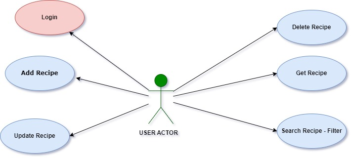
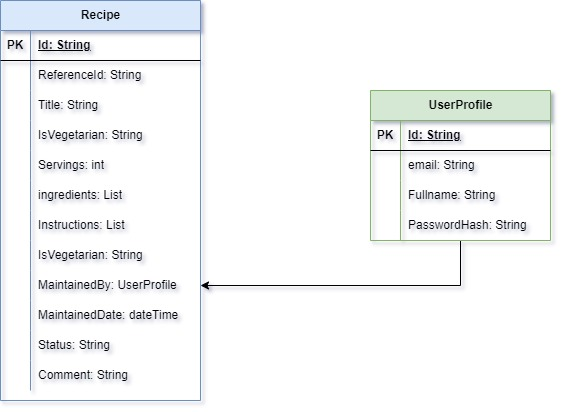
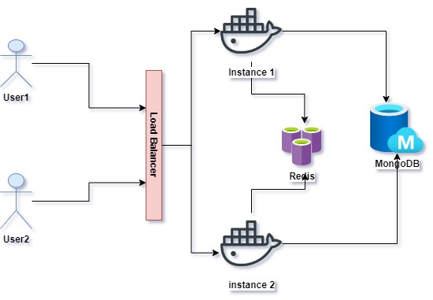

# Recipe Bankend Design Document 
This is a high level design followed to come up with the solution for the recipe management

# System Features and Requirements 

## Functional Requirement
## User - Actor 
• Login<br/>
• Add New Recipe<br/>
• Update Recipe<br/>
• Fetch Recipe - (By Id or UserId)<br/>
• Delete Recipe(Updating the status to Deleted)<br/>
• Search Recipe - By Filter



# Non Functional Requirement
• We will need the service to support high Loads(Scalability) - By utilizing Containers and Kubernetes <br/>
• Only Login Users can manage their recipes (Security)<br/>
• Monitoring - We need to be able to expose monitoring endpoints like actuators to tools like Prometheus<br/>
• Low Latency - We will improve latency by using Load balancers and Database sharding when data becomes so large<br/>
<br/>

# Assumptions
• Registration Service Exist - Users will be created and initialize once the system startsup/>
• This Service will be used by restuarants/Cooks/Users in Netherlands
• There is about 16,000 resturants in Netherlands and about 100,000 chefs and cooks according to statistics
<br/>

# Performance and Capacity Planning
I looked at Performance based on Traffic,Storage,BandWidth and Memory but focus more on the first two.

## Traffic Estimation
### Write Request per Day: 500,000
 > Create Recipe<br/>
 > Update Recipe<br/>
 > Delete Recipe<br/>

### Read Request per Day:
 > Search Criteria<br/>
 > GetRecipe<br/>

However, READ is always higher than WRITE which shows we need to improve Search and Read Access


# API Definitions

## Methods

The use cases were modelled as the API Endpoints as can be show below:

```http
login(userId,password)
createRecipe(RecipeRequest)
getRecipeById(recipeId)
getRecipeByUserId(userId,recipeId)
deleteRecipe(recipeId, comment)
updateRecipe(recipeId, RecipeRequest)
searchRecipeByCriteria(isVegetarian, servings,ingredient,instruction,pageNumber,pageSize)
```
The use cases were modelled as the API Endpoints as can be show below:

| # | **Api**                                     | **Description**                                             |
|---|---------------------------------------------|-------------------------------------------------------------|
| a | GET /api/dhdhdhhdhdhhdhdhdhhdhhhhdhd        | Thisnskwmdkwmkfmwfwmfkwmfkwmfkwfkwmkfmwkfmwkfmwkdfw         |
| 1 | GET /api/v1/recipes/{recipeId}              | This API retrieves the Recipe Detail based on ID            |
| 2 | GET /api/v1/recipes?                        | This API searches recipe database based on searcyh criteria |
| 3 | POST /api/v1/recipes                        | Use for creating new Recipe on the System                   |
| 4 | PUT /api/v1/recipes                         | Use for updating Recipe Records                             |
| 5 | DELETE /api/v1/recipes/{recipeId}/{comment} | For deleting records - ideally the status will be updated   |


# Data Model


### Requirement for Database Choice
Although the Recipe is a structured data which fits better with an SQL databsse,However, i will go for a NoSQL Db, Mongo or Elastic Search or a combination of both if more analytics are needed in the future and here are my reasons

• Its easier to represent/Model my Recipe and user data as json without the need for a schema<br/>
• Analytical database because of the ratio of more read to write<br/>
• Nosql databases also perform fater than SQL databases<br/>
• Analytical database because of the ratio of read to right and search Queries<br/>
• Easy to scale horizonally across clusters and sharding is automatic thereby improving performance<br/>
• It will be easy for me to add more parameters in the future when new demands comes up<br/>
• Eventual Consistency as the system doesnt involve a transactional processs - no need for rollback or commit<br/>
• BASE compliant NOSQL system like MongoDB or Elastic Search or a combination of both while i use MongoDB as the DB and push a copy of the transaction to Elastic Search for proper analytics.<br/>


# High Level Design and Architecture


I will need multiple application servers to serve all the read/write requests with load balancers in front of them for traffic distributions. If we’re assuming that we will have a lot more read traffic (as compared to write), we can decide to have separate servers for handling these scenarios.
This is very much possible with docker and kubernetes and we can easily replicate and scale our mongodb if the need arises


# Detail Design and WorkFlow

### Login Request Flow


### Create Recipe Request Flow


### How to avoid Double Recipe and ensures Idempotency
• I used a simple appraoch of making the referenceId and User a unique constraint from the database Level so as to prevent double creation<br/>
• I can also add a second level validation on the redis using the same key (Reference and UserId) to acquire a Lock especially when we start scaling and using multiple databases<br/>

# Security Considerations
• I implemented the JSON Web Token(JWT) security Authentication which is one of the popular and supported model for REST API calls<br/>
• I also changed from Http to Https<br/>

# Monitoring
I enabled Spring actuator which automatically exposes so many endpoints like metrics,health,info and others<br/>
which can be plugged to any Monitoring Platforms like Micrometer,DataDog or Prometheus


### Technology Choices
• Spring Boot Framework<br/>
• MapStruct - I chooose Mapstruct because of less code and Performance and also huge following with support<br/>
• Maven<br/>
• Redis<br/>
• MongoDB  - the mother of all NODQL, document, huge support and followings(popular)<br/>
• Docker<br/>
• Kuberenetes<br/>
• Jenkins Cicd Pipelines<br/>
• jacoco code coverage<br/>
• Apache Jmeter for Perormance Testing<br/>

# Further Recommendations
• Deploying a Load balancer in the future<br/>
• Completing the jenkins pipeline for a full CICD deployment<br/>
• Logging should be congifured via Async event based stream using Apache Kafka<br/>
• Implementing Redis Lock once database scaling is decided<br/>
• I can also configure the SL4J loggers to send email when a fatal error occurs<br/>
• Validating the Search Filter Parameters<br/>
• Completing the Authentication Role for each Action<br/>

